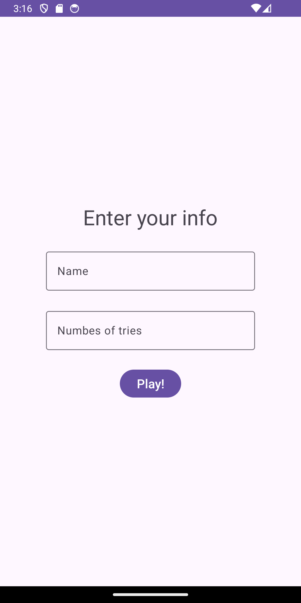
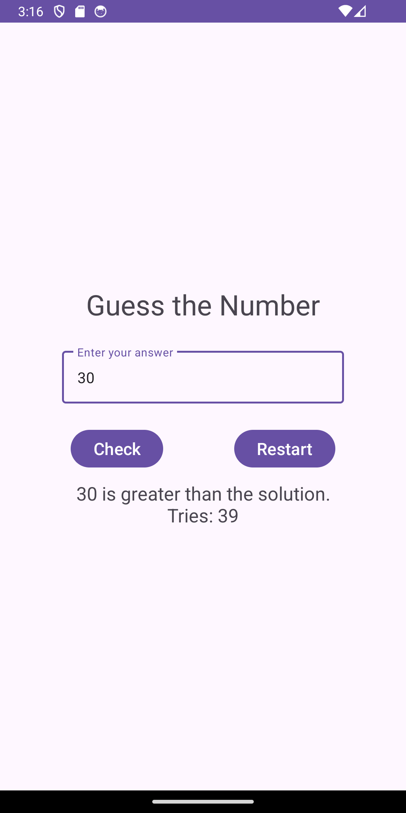
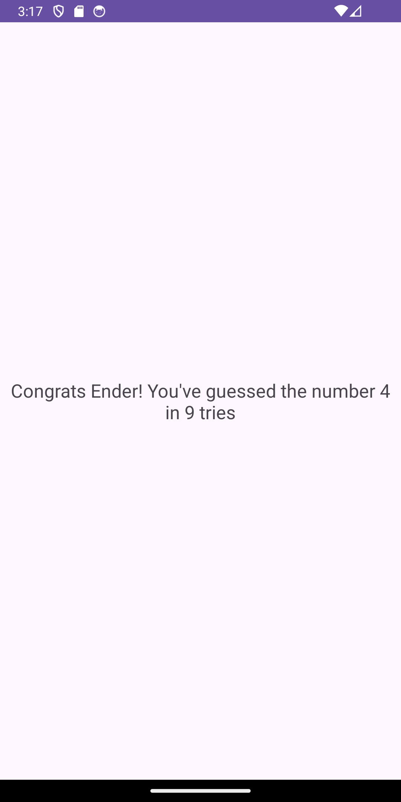

# GuessNumber   

Esta aplicación consiste en adivinar un número aleatorio del 1 al 100. Antes de poder empezar a jugar se pedirá el nombre del jugador y el número que intentos, cuantos más intentos se pida más fácil será el juego.

Si el jugador gasta todos sus intentos podrá decidir empezar de nuevo la partida, y con ello generar un nuevo número, o terminar y ver la solución. Si el jugador lo adivina, verá los intentos que ha necesitado.

Este programa está compuesto de tres Activity, y dos de ellos utilizan MVVM. También está traducido para el español y el inglés. 

<table>
    <tr>
        <th colspan="3">
Screenshots
</th>
    </tr>
    <tr>
        <th></th>
        <th></th>
        <th></th>
    </tr>
</table>
